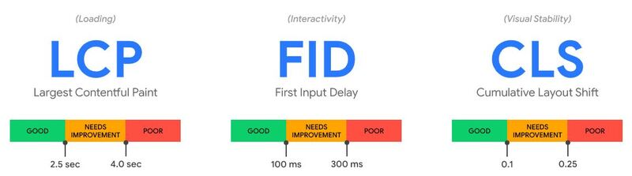
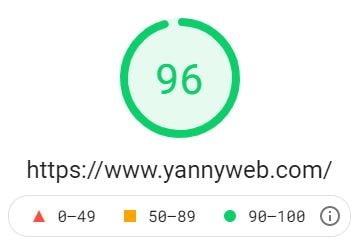
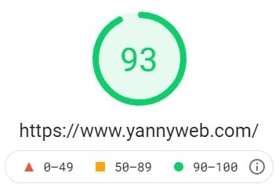
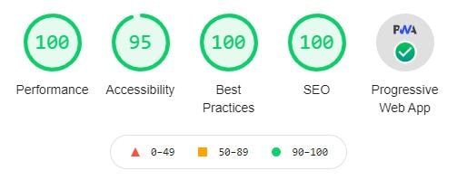
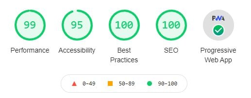

import { Link } from "gatsby"

Let’s get straight to the point. The faster your website loads, the less your bounce rate will be, which can increase your conversion rate.

If your website is fast, you have a greater chance of ranking on Google compared to a competitor whose website is slow and has a high bounce rate.

Back in April 2020, Google announced that your [page speed can affect your google ranking](https://developers.google.com/search/blog/2010/04/using-site-speed-in-web-search-ranking), so it is important that you add this to your SEO strategy.

And more recently, Google also announced that [Core Web Vitals will become a ranking signal](https://developers.google.com/search/blog/2020/11/timing-for-page-experience) from May 2021.



This post will help the performance of [Largest Contentful Paint (LCP)](https://web.dev/lcp/) and [First Input Delay (FID)](https://web.dev/fid/).

So, we now know that website page speed is very important. However, don't just concentrate on your desktop speed, as over 50% of users use a mobile device to browse the internet.

Making your website load faster is not always an easy feat. There are many things that can contribute to slowing down your website, so you need to use some tools to help you identify these issues.

### How to test your website speed?

There are numerous tools you can use to test your website speed. I tend to use the following:

- [Google PageSpeed Insights](https://developers.google.com/speed/pagespeed/insights/)
- [Google Lighthouse](https://developers.google.com/web/tools/lighthouse/)
- [GT Metrix](https://gtmetrix.com/)

The first two are powered by google so it makes sense to use their performance analysis tools as a benchmark. GTmetrix is easy to use and gives you a nice breakdown of issues.

Once you’ve performed a speed test, you will get the results displayed and a list of issues and opportunities on how to increase your performance.

Give it a go, and see what your scores are.

<blockquote display="info">
  In this post we will concentrate on some of the quick wins. By doing these
  quick fixes that I list below, you can speed up your website in no time and
  increase those Core Web Vitals scores.
</blockquote>

### Optimise Images

Images equate to a large amount of your content, so reducing the size will make a huge impact on your website's speed.

#### Properly Size Images

Serve images that are appropriately sized to save mobile data and improve load time.

Use the appropriate dimensions for all your images. If there is an image that is displayed as a thumbnail on your website, then resize the image to that size.

#### Optimise quality

Reducing the quality of an image saves you a lot of KB, without affecting the image too much. I use [Image Compressor](https://imagecompressor.com/) which does a great job of this.

Have a look at these two images. Which one has been compressed?


The bottom one has been compressed and you can hardly tell. Top image is 55KB and bottom image is 11KB. A whopping 80% difference.

Doing this to all of your images will make a huge difference in your page speed performance.

#### Modern image formats

[WebP](https://developers.google.com/speed/webp) is a modern image format that is significantly smaller than jpg and png that does not compromise the image quality.

Most browsers support [WebP](https://developers.google.com/speed/webp) but you can always serve an alternative image format as a fallback in case it does not.

I’ve used [ezgif](https://ezgif.com/webp-maker) to convert images to WebP in the past, which is a great tool but most web development platforms will have a plugin that does this. I use Gatsby as my platform which has a great plugin called [gatsby-image](https://www.gatsbyjs.com/plugins/gatsby-image/). It serves a WebP image with a fallback of the orginial image format, plus a whole lot more image optimisations.

[AVIF](https://www.freecodecamp.org/news/how-to-use-avif-images-on-your-website/) is another modern format that is 50% smaller than JPG and 20% smaller than WebP. I've only started using it as recent as this post through the awesome power of Gatsby plugins. Currently, only Chrome, the latest Firefox and Opera support this format so if you do use it, have a fallback format in place. I will keep a close eye on this one.

#### art direction

Serving a different optimised image based on device size will increase your mobile speed performance. If you are using a Hero image, consider having a mobile optimised image based on the dimensions of a mobile device. I generally go with 400px width.

### Compress your files

Reducing the size of your CSS, HTML and JavaScript can make a big impact on performance. This can be done by using [Gzip](https://www.gnu.org/software/gzip/) or [Brotli](https://www.boldgrid.com/support/w3-total-cache/what-is-brotli-compression-and-why-do-i-need-it/) file compression.

Most web development platforms will have a plugin to do this and some hosting platforms will automatically do this for you. [Netlify compress using Brotli](https://www.netlify.com/blog/2020/05/20/gain-instant-performance-boosts-as-brotli-comes-to-netlify-edge/) as a standard.

### Minify CSS, JavaScript, and HTML

By optimising your code by removing all spaces, commas, and other unnecessary characters, you can reduce the file size and increase your page speed. Most web development platforms will have a plugin to do this. Some hosting platforms can do this too.

### Remove unused CSS

If you use CSS frameworks such as Bootstrap, Material UI, Tailwind then you will no doubt have a lot of unused CSS that is being loaded unnecessarily. You can use a plugin such as [PurgeCSS](https://purgecss.com/) to remove unused CSS. PurgeCSS analyses your content and your CSS files, then matches the selectors used in your files with the one in your content files. It removes unused selectors from your CSS, resulting in smaller CSS files.

The site has useful guides for different web development platforms on how to implement this.

Always check over your website after using this plugin just in case it has removed any necessary CSS.

### Content Delivery Networks (CDN)

<blockquote display="info">
  A distributed network optimised for serving assets to users. By being
  geographically distributed, a CDN can provide redundancy and also improve
  delivery performance as a result of servicing requests from the infrastructure
  closest to the user making the request.
</blockquote>

A CDN caches your content so it is optimised and ready to be served to a user from a location close to them.

I generally use [Netlify](https://www.netlify.com/) to host my sites which use CDNs as a free service. There are other CDNs out there such as Cloudflare, AWS, Google. Some offer a free service.

### Preload Key requests

By adding rel="preload" to certain resources such as fonts, you are telling the browser that you would like to fetch it sooner. Without preload, the browser will fetch that resource later during the page loading which causes a delay.

Add the rel="preload" to the head of your HTML like this:

```html
<link rel="preload" as="script" href="example.js"></link>
```

### 3rd Party Scripts

We all use 3rd party scripts on our sites for analytics. Google analytics, Google tag manager, Facebook pixel, Mailchimp to name a few. These scripts generally come with a lot of overheads that affect performance.

Firstly, analyse the scripts you use and ask yourself if you really need them.

Look at integrating your scripts through Google Tag Manager. You can also delay when the script should load. Here is an example on [how to integrate Facebook pixel](https://www.facebook.com/business/help/1021909254506499).

#### Use async or defer

The async and defer attributes tell the browser that it may go on parsing the HTML while loading the script in the background, and then execute the script after it loads. The result is that the user can see the page before all scripts have finished loading.

```html
<script defer src="/example.com"></script>
<script asnyc src="/example.com"></script>
```

### Conclusion

These are just some quick fixes that can be done to increase your websites performance and get you better core web vitals scores, but there are many other aspects here that I have missed out that can have a huge impact too. These generally require some knowhow from a good web developer.

A lot of websites out there generally do not pay attention to these quick fixes. I’ve seen a lot of these websites serving up MBs worth of images which is obscene and adding lots of 3rd party scripts without assessing the impact on performance.

To demonstrate, take a look at the scores of my website's <Link to="/">home page</Link>. By using the quick fixes above, I've managed to get near perfect scores on the three listed speed test platforms I mentioned.

#### Pagespeed Insights (Desktop, Mobile)




#### Google Lighthouse (Desktop, Mobile)




#### GTmetrix (Desktop)


### Need Help?

If you're struggling to get your speed performance up, then you may have some other underlying issues with your website. Perhaps the code is written poorly, or you have too many page elements, or too many plugins. Contact <Link to="/contact/">yannyweb</Link> if this is you.

<Link to="/posts" className="btn center-btn">
  all posts
</Link>
